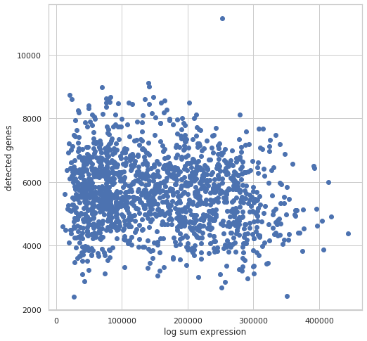
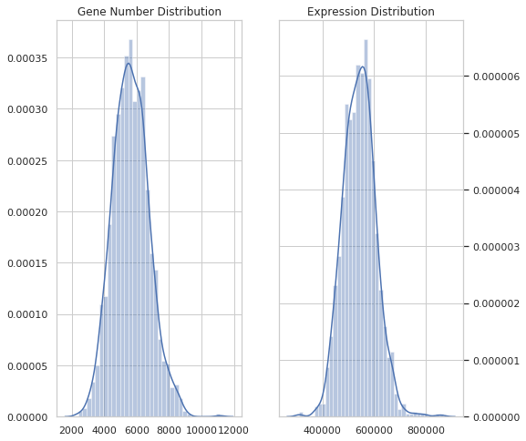
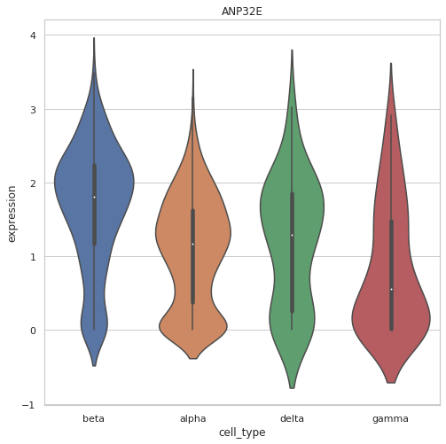
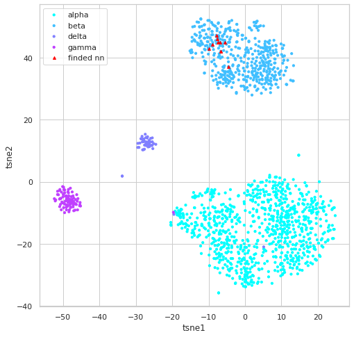

# SingleAnalyst

## Introduction
**SingleAnalyst** is an integrated platform for single-cell RNA-seq data analysis,focusing on the cell type assignment problem. 
SingleAnalyst implemented various quality control, normalization and feature selection methods for data preprocessing, and 
featured a k-nearest neighbors based cell type annotation and assignment methods. And extended the method to large scale by 
introducing several approximate algorithms.


**SingleAnalyst** consists of three part: **data preprocessing**, **data inspecting** and **knn based cell type assignment**

  * **Data preprocessing**: SingleAnalyst implemented multiple quality control, data normalization and feature selection methods, which are conventionally applied in single-cell RNA-seq analysis.
  * **Data inspecting**: SingleAnalyst employed a couple of useful visualization functions for data investigation, as well as a embedded neighbor density based cluster method.
  * **kNN based cell type assignment**: SingleAnalyst implemented a k-nearest neighbors based cell type annotation methods. Furthermore, for large-scale single cell RNA-seq data analysis several approximate nearest neighbors methods were deployed, providing the ability to deal with data of variety scale. 

 
## Requirement
* python3 >= 3.6
* linux

## Install
1. Install some dependencies by [Anaconda](https://www.anaconda.com) or system's package manager (as pip did not work properly for those packages)
    ```sh
    conda install numpy bitarray
    conda install faiss-cpu -c pytorch
    ```
2. Download SingleAnalyst
    ```sh
    git clone git@github.com:bm2-lab/Singleanalyst.git
    ```
2. Install SingleAnalyst
    ```sh
    pip install ./Singleanalyst
    ```

## Usage
### Data preprocessing
#### Read data

Read data, and create a singleCellData object.
```python
from SingleAnalyst.basic import indexedList, infoTable, singleCellData

gene_info = indexedList(gene_list)
cell_info = infoTable(
    ['cell_list', 'cell_type'],
    [cell_list, cell_type_list])
ex_m =  np.loadtxt('expression',delimiter="\t", skiprows=1)
dataset = singleCellData(ex_m, gene_info, cell_info)
```

Or, read from saved data
```python
import SingleAnalyst

datapath = 'example_data'
data_set = SingleAnalyst.dataIO.read_data_mj(datapath)
```

After data was loaded, there are tools for visually inspected data
```python
SingleAnalyst.vis.plot_g_e(dataset, log=True)
SingleAnalyst.vis.dist_plot(dataset)
```



#### Quality control
Filter out low quality data
```python
f1 = SingleAnalyst.filter.minGeneCellfilter()
f2 = SingleAnalyst.filter.minCellGenefilter()

dataset = dataset.apply_proc(f1)
dataset = dataset.apply_proc(f2)
```

#### Normalization
Data normalization
```
norm = SingleAnalyst.normalization.logNormlization()
dataset.apply_proc(norm)
```

#### Feature selection
Select informative feature.
```python
s1 = SingleAnalyst.selection.dropOutSelecter(num_features=500)
s2 = SingleAnalyst.selection.highlyVarSelecter(num_features=500)
s3 = SingleAnalyst.selection.randomSelecter(num_features=500)

dataset.apply_proc(s1)
```
The selected featrues, could be visualized
```python
# random pick one feature
one_f = np.random.choice(np.arange(dataset.gene_num))
gn = dataset.index_to_gene([one_f])
v_plot1 = scr.vis.gene_violinplot(dataset, gn[0])
```



### Index build and similar search
For illustration purpose, we split data for test
```python
train_d, test_d = SingleAnalyst.process.tt_split(dataset)
refdata = SingleAnalyst.RefData.queryData(train_d)
q_xdata = SingleAnalyst.RefData.queryData(test_d)
```

#### Build index for reference data
```python
nn_indexer = SingleAnalyst.index.faiss_baseline_nn()

index = SingleAnalyst.index.indexRef(refdata, nn=nn_indexer)
```

#### kNN search and cell type annotation
```python
qxm = q_xdata.get_qxm(gene_list=index.gene_ref.get_list())

res = index.get_predict(qxm=qxm)

# visually inspect knn result  
i_qx = qxm[19,:]
nnf = index.get_knn_vis(i_qx)
```


## Contacts
yuyifei@tongji.edu.cn or qiliu@tongji.edu.cn
